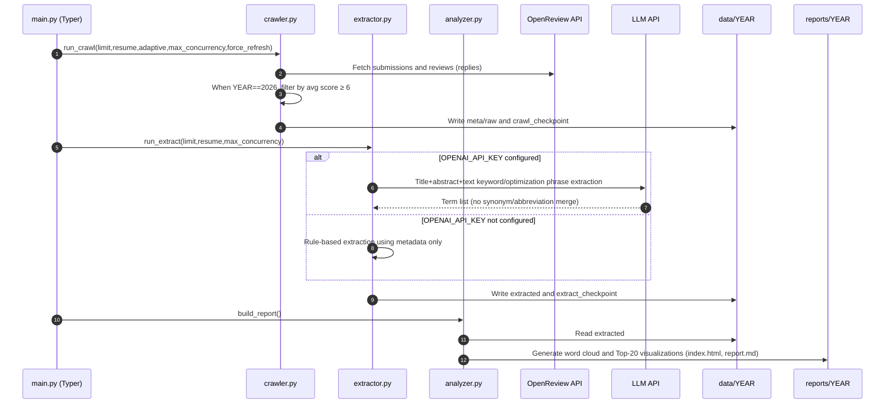

# Design Doc

This document describes the system architecture, core flow, and module responsibilities, and provides Mermaid-based architecture and sequence diagrams.

## Architecture Diagram

```mermaid
flowchart TD
  subgraph Source[Data Sources]
    OR[OpenReview API]
  end

  subgraph Processing[Processing Pipeline]
    C[crawler.py (Crawl)] --> E[extractor.py (Extract)]
    E --> A[analyzer.py (Analyze)]
  end

  M[main.py CLI pipeline] --> C
  M --> E
  M --> A

  OR --> C
  C --> META[data/YEAR/meta]
  C --> RAW[data/YEAR/raw]
  C --> STATE1[data/YEAR/state]

  E --> EXT[data/YEAR/extracted]
  E --> STATE2[data/YEAR/state]

  A --> RPT[reports/YEAR/]

  classDef store fill:#f7f7f7,stroke:#999,color:#333;
  class META,RAW,EXT,STATE1,STATE2,RPT store;
```

## Core Flow Diagram



## Module Responsibilities
- `main.py`: Unified CLI entry; provides the `pipeline` command chaining crawl → extract → analyze.
- `crawler.py`: Fetches metadata and PDFs from OpenReview; maintains checkpoint; for 2026, counts only submissions with average review score ≥ 6.
- `extractor.py`: Parses PDFs and metadata, optionally calls LLM to extract keywords and optimization phrases, outputs structured JSON and checkpoints.
- `analyzer.py`: Aggregates extraction results, generates word clouds and Top-20 charts, outputs `index.html` and `report.md`.
- `util.py`: Utility methods for env loading, directory creation, atomic writes, and checkpoint I/O.

## Configuration and Environment Variables
- Required: `YEAR`, `OPENREVIEW_USERNAME`, `OPENREVIEW_PASSWORD`
- Optional (enable LLM): `OPENAI_BASE_URL`, `OPENAI_API_KEY`, `OPENAI_MODEL`
- Optional: `OPENREVIEW_API_BASE`, `USER_AGENT`

## Data Directories
- `data/{YEAR}/meta/`: paper metadata JSON
- `data/{YEAR}/raw/`: original paper PDFs
- `data/{YEAR}/extracted/`: extracted structured JSON
- `data/{YEAR}/state/`: pipeline checkpoints
- `reports/{YEAR}/`: visualization report artifacts

## Key Design Points
- Sample definition (2026): uses submissions with average review score ≥ 6 as the statistical sample to reduce bias from unfinalized papers; distributions may differ from the officially accepted set.
- Adaptive concurrency and checkpointing: control concurrency and use checkpoints to reduce retry cost and improve stability.
- Optional LLM extraction: analysis remains functional without an API key to ensure usability.

## Extension Suggestions
- Term normalization: unify synonyms and abbreviations during analysis (e.g., merge `LLM` and `large language models`) to improve cross-year comparison stability.
- Extraction enhancement: design a dedicated prompt template for optimization directions to improve phrase quality and consistency.