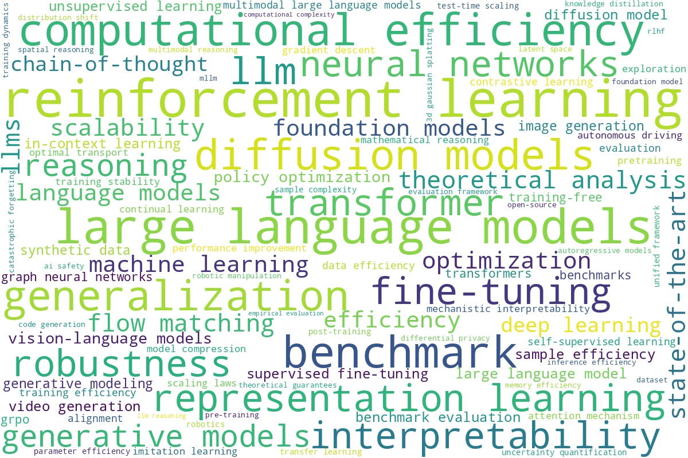
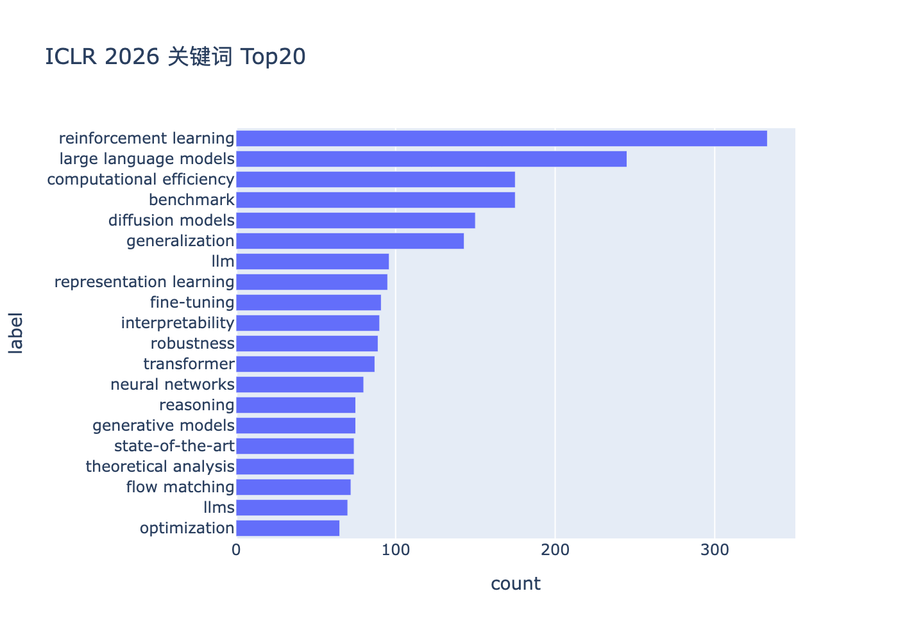
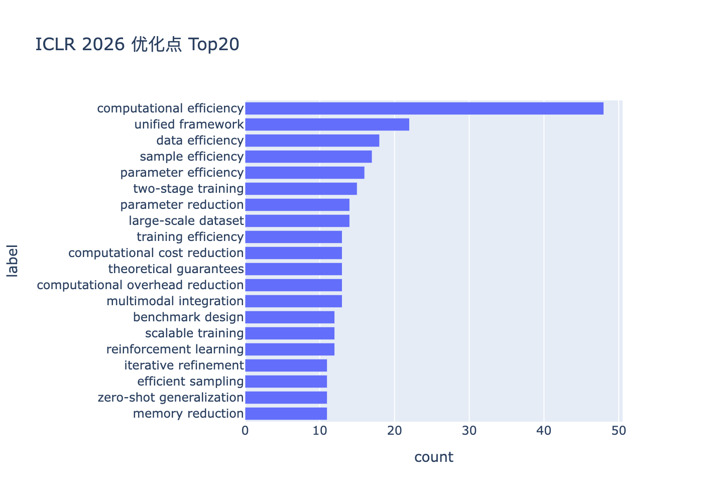

# ICLR 2025/2026 论文对比分析

本项目面向 ICLR 2025 与 ICLR 2026 论文集，用 LLM 提取论文中出现频次，提取年度热点主题与优化方向。统计与可视化由本项目代码自动完成。

## 快速开始
``` python
# 在 .env 设置好相关环境变量，参考：.env_example
YEAR=2025 uv run main.py pipeline --extract-max-concurrency=50 --crawl-max-concurrency=10
YEAR=2026 uv run main.py pipeline --extract-max-concurrency=50 --crawl-max-concurrency=10
```
具体使用方式参考：。如果想了解项目的技术设计，参考：

## 结论与建议
先说结论：
- 研究重心从“单一模型/算法扩展”逐步转向“评测体系、推理能力与训练流程优化”，效率优化仍为长期主线；
- 强化学习相关主题在 2026 论文集（2025年下半年投稿）显著抬头，可能与复杂任务的规划/交互能力需求增加有关；
- 评测与基准的重要性持续上升，提示社区对“可比性、可复现性与稳健性”的关注增强；
- 建议：
  - 在方法设计上兼顾效率与流程（例如两阶段训练、统一框架与迭代改进），并强化对基准与零样本泛化的评估；
  - 针对 LLM 的“推理+强化学习”结合方向值得进一步投入，关注采样与大规模数据处理的工程可行性。

## 统计方法
- 数据范围：ICLR 2025 与 ICLR 2026 论文集的标题与摘要文本（按术语出现次数进行统计）。
- 年度样本说明：
  - 2025：使用已正式接收论文的标题与摘要；共 3704 篇。
  - 2026：因尚未正式接收，选取评审均分≥6的投稿作为统计样本（均分按单篇投稿的所有评审评分取平均）；共 1798 篇。
- 统计项目：关键词词频 Top20、优化方向 Top20、词云与占比分析。
- 处理流程：
  - 使用 LLM 对每篇论文标题与摘要提取关键词，输出标准化术语列表；Prompt: 
    ```
    '你是资深学术助手。根据论文标题、摘要与正文片段，仅返回一个 JSON 对象：{"tags": [...], "optimizations": [...]}。\n'
    "- tags：不超过20个，均为关键词或短语；\n"
    '- optimizations：不超过10个，必须是论文相较之前工作的优化方向或优化方法；聚焦方法、策略、架构或数据流程的改进；每项为2–3个关键词的短语，避免完整句子与标点，例如 "data augmentation", "multi-task training", "adapter tuning"。\n'
    "- 输出为纯JSON，不包含解释或其他文本。"
    ```
  - 汇总术语词频，计算 Top20 并生成可视化。图表中的横轴为出现次数 `count`，纵轴为对应术语标签。  

## 数据展示

**2025 年度**

- 关键词云图：
  
  

- 关键词 Top20：
  
  

- 优化点 Top20：
  
  


**2026 年度**

- 关键词云图：
  
  

- 关键词 Top20：
  
  

- 优化点 Top20：
  
  


## Top20 明细（计数）

**2025 年关键词 Top20**

| 排名 | 关键词 | 计数 |
|---|---|---|
| 1 | large language models | 674 |
| 2 | diffusion models | 428 |
| 3 | computational efficiency | 422 |
| 4 | reinforcement learning | 411 |
| 5 | generalization | 337 |
| 6 | iclr 2025 | 296 |
| 7 | fine-tuning | 284 |
| 8 | benchmark | 278 |
| 9 | neural networks | 271 |
| 10 | deep learning | 265 |
| 11 | machine learning | 248 |
| 12 | robustness | 239 |
| 13 | generative models | 234 |
| 14 | theoretical analysis | 219 |
| 15 | representation learning | 219 |
| 16 | optimization | 215 |
| 17 | transformer | 214 |
| 18 | graph neural networks | 201 |
| 19 | language models | 199 |
| 20 | interpretability | 197 |

**2026 年关键词 Top20**

| 排名 | 关键词 | 计数 |
|---|---|---|
| 1 | reinforcement learning | 333 |
| 2 | large language models | 245 |
| 3 | benchmark | 175 |
| 4 | computational efficiency | 175 |
| 5 | diffusion models | 150 |
| 6 | generalization | 143 |
| 7 | llm | 96 |
| 8 | representation learning | 95 |
| 9 | fine-tuning | 91 |
| 10 | interpretability | 90 |
| 11 | robustness | 89 |
| 12 | transformer | 87 |
| 13 | neural networks | 80 |
| 14 | generative models | 75 |
| 15 | reasoning | 75 |
| 16 | theoretical analysis | 74 |
| 17 | state-of-the-art | 74 |
| 18 | flow matching | 72 |
| 19 | llms | 70 |
| 20 | optimization | 65 |

**2025 年优化点 Top20**

| 排名 | 优化点 | 计数 |
|---|---|---|
| 1 | computational efficiency | 154 |
| 2 | parameter efficiency | 69 |
| 3 | sample efficiency | 44 |
| 4 | generalization enhancement | 41 |
| 5 | data efficiency | 41 |
| 6 | theoretical guarantees | 36 |
| 7 | training efficiency | 34 |
| 8 | benchmark design | 31 |
| 9 | unified framework | 30 |
| 10 | end-to-end training | 27 |
| 11 | synthetic data generation | 27 |
| 12 | bias mitigation | 27 |
| 13 | empirical validation | 27 |
| 14 | data augmentation | 25 |
| 15 | robustness enhancement | 24 |
| 16 | computational cost reduction | 24 |
| 17 | memory efficiency | 24 |
| 18 | theoretical framework | 23 |
| 19 | computational reduction | 22 |
| 20 | memory reduction | 21 |

**2026 年优化点 Top20**

| 排名 | 优化点 | 计数 |
|---|---|---|
| 1 | computational efficiency | 48 |
| 2 | unified framework | 22 |
| 3 | data efficiency | 18 |
| 4 | sample efficiency | 17 |
| 5 | parameter efficiency | 16 |
| 6 | two-stage training | 15 |
| 7 | large-scale dataset | 14 |
| 8 | parameter reduction | 14 |
| 9 | multimodal integration | 13 |
| 10 | computational overhead reduction | 13 |
| 11 | theoretical guarantees | 13 |
| 12 | computational cost reduction | 13 |
| 13 | training efficiency | 13 |
| 14 | reinforcement learning | 12 |
| 15 | scalable training | 12 |
| 16 | benchmark design | 12 |
| 17 | memory reduction | 11 |
| 18 | zero-shot generalization | 11 |
| 19 | efficient sampling | 11 |
| 20 | iterative refinement | 11 |

## 年度对比与分析

- 语料规模差异：Top20 总计数（关键词）在 2025 年约为 5851，2026 年约为 2354；（优化点）2025 年约为 751，2026 年约为 309。绝对值下降说明直接同比会受样本量影响，更应参考占比与排序。另：2026 年样本以评审均分≥6的投稿为统计对象，样本量与分布可能与正式接收集存在差异。
- 主题占比变化（关键词）：
  - 强化学习（reinforcement learning）占比由约 7.0% 提升至约 14.1%，相对关注度显著上升；
  - 评测与基准（benchmark）占比由约 4.8% 上升至约 7.4%，评价体系与测评导向更加突出；
  - 大模型（large language models）占比由约 11.5% 微降至约 10.4%，依然核心但不再过于单一；
  - 扩散模型（diffusion models）占比由约 7.3% 降至约 6.4%，关注度略有回落；

- 优化方向变化（优化点）：
  - `computational efficiency` 两年均居首位，体现效率优化仍是主线，但绝对计数下降提示样本规模影响；
  - 2026 年更强调流程与系统层面的改良，如 `unified framework`、`two-stage training`、`iterative refinement`、`scalable training`、`multimodal integration` 等，说明从单点效率到整体管线的工程化与可扩展性提升；
  - `parameter efficiency` 等传统模型层优化的占比相对回落，`data efficiency` 与大规模数据/采样相关优化的重要性上升。

