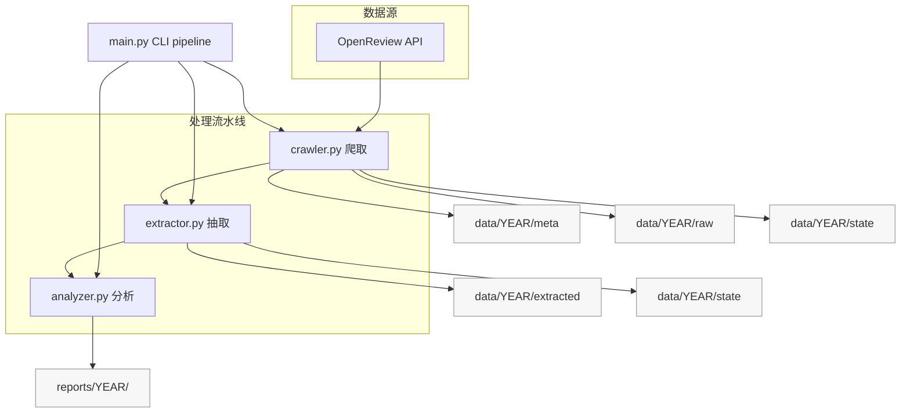
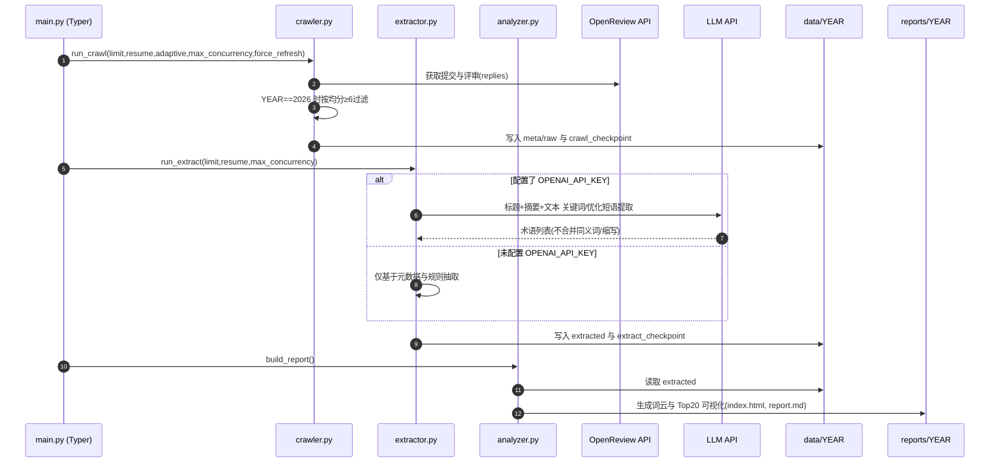

# 设计文档

本文档描述系统架构、核心流程与模块职责，并提供基于 Mermaid 的架构图与时序图。

## 架构图

## 核心流程图

## 模块职责
- `main.py`：统一 CLI 入口，提供 `pipeline` 命令，串联爬取→抽取→分析。
- `crawler.py`：从 OpenReview 抓取元数据与 PDF，维护 checkpoint；2026 年仅统计评审均分≥6的投稿样本。
- `extractor.py`：解析 PDF 与元数据，调用 LLM（可选）抽取关键词与优化短语，输出结构化 JSON 与 checkpoint。
- `analyzer.py`：聚合抽取结果，生成词云与 Top20 图表，并输出 `index.html` 与 `report.md`。
- `util.py`：环境变量加载、目录创建、原子写、checkpoint 读写等工具方法。

## 配置与环境变量
- 必填：`YEAR`、`OPENREVIEW_USERNAME`、`OPENREVIEW_PASSWORD`
- 可选（启用 LLM）：`OPENAI_BASE_URL`、`OPENAI_API_KEY`、`OPENAI_MODEL`
- 可选：`OPENREVIEW_API_BASE`、`USER_AGENT`

## 数据目录
- `data/{YEAR}/meta/`：论文元数据 JSON
- `data/{YEAR}/raw/`：论文 PDF 原件
- `data/{YEAR}/extracted/`：抽取后的结构化 JSON
- `data/{YEAR}/state/`：流程 checkpoint
- `reports/{YEAR}/`：可视化报告产物

## 关键设计点
- 样本口径（2026）：使用评审均分≥6的投稿作为统计样本，避免未定稿带来的偏差；与正式接收集可能存在分布差异。
- 自适应并发与断点续跑：通过并发控制与 checkpoint 减少失败重试带来的开销，提升稳定性。
- LLM 抽取的可选性：在未配置 API Key 的环境下仍可完成分析，确保可用性。

## 扩展建议
- 术语规范化：在分析阶段统一同义词与缩写（如将 `LLM` 与 `large language models` 归并）以提升跨年度对比的稳定性。
- 抽取增强：为优化方向构建独立的提示词模板，提升短语质量与一致性。